# Практическая работа: Введение в язык Java в контексте мобильной разработки

> [!NOTE]
> **Цель работы:** Освоить базовый синтаксис языка Java, принципы объектно-ориентированного программирования (ООП), механизмы интерфейсов и стандартные структуры данных, необходимые для разработки нативных компонентов мобильных приложений.

---

## 📋 Содержание

1. [Вводные требования и инструментарий](#0-вводные-требования-и-инструментарий)
2. [Тема 1. Базовый синтаксис, примитивные типы и операторы](#тема-1-базовый-синтаксис-примитивные-типы-и-операторы)
3. [Тема 2. Управляющие конструкции и операторы ветвления](#тема-2-управляющие-конструкции-и-операторы-ветвления)
4. [Тема 3. Массивы, строки и форматирование данных](#тема-3-массивы-строки-и-форматирование-данных)
5. [Тема 4. Методы и модульность](#тема-4-методы-и-модульность)
6. [Тема 5. Классы, объекты и инкапсуляция](#тема-5-классы-объекты-и-инкапсуляция)
7. [Тема 6. Наследование и полиморфизм](#тема-6-наследование-и-полиморфизм)
8. [Тема 7. Абстрактные классы и интерфейсы](#тема-7-абстрактные-классы-и-интерфейсы)
9. [Тема 8. Коллекции и Generics](#тема-8-коллекции-и-generics)
10. [Тема 9. Исключения и безопасность выполнения](#тема-9-исключения-и-безопасность-выполнения)
11. [50 Смешанных практических заданий (Mobile Logic Focus)](#50-смешанных-практических-заданий)
12. [Критерии оценки и регламент сдачи](#критерии-оценки-и-регламент-сдачи)

---

## 0. Вводные требования и инструментарий

Для выполнения заданий рекомендуется использовать актуальное окружение разработки:

- **JDK:** OpenJDK 21 LTS или OpenJDK 25.
- **IDE:** Android Studio (Ladybug / Hedgehog / Jellyfish) или IntelliJ IDEA Community / Ultimate.
- **Система сборки:** Gradle (Kotlin DSL или Groovy DSL).

> [!TIP]
> При написании консольных классов для отладки создавайте классический метод точки входа:
>
> ```java
> public class Main {
>     public static void main(String[] args) {
>         System.out.println("Java for Android is ready!");
>     }
> }
> ```

---

## Тема 1. Базовый синтаксис, примитивные типы и операторы

Язык Java является строго типизированным. Примитивные типы хранят значения непосредственно в стеке памяти, что критично для энергоэффективности мобильных чипов.

### Таблица типов данных

| Тип       | Размер     | Диапазон / Значение         | Мобильный контекст                        |
| :-------- | :--------- | :-------------------------- | :---------------------------------------- |
| `byte`    | 8 бит      | -128 .. 127                 | Буферы сырых сетевых пакетов, аудио       |
| `short`   | 16 бит     | -32 768 .. 32 767           | Обработка датчиков (акселерометр)         |
| `int`     | 32 бит     | \(-2^{31}\) .. \(2^{31}-1\) | ID ресурсов `R.id.*`, индексы списков     |
| `long`    | 64 бит     | \(-2^{63}\) .. \(2^{63}-1\) | Таймстемпы Unix (мс), ID сущностей SQLite |
| `float`   | 32 бит     | IEEE 754                    | Координаты экрана, плотность dp/sp        |
| `double`  | 64 бит     | IEEE 754                    | Геолокация (GPS широта и долгота)         |
| `boolean` | 1 бит/байт | `true` / `false`            | Флаги видимости, состояния переключателей |
| `char`    | 16 бит     | `\u0000` .. `\uffff`        | Одиночные символы ввода                   |

### Пример кода

```java
public class ScreenMetrics {
    public static void main(String[] args) {
        final double LATITUDE = 54.0105;
        final double LONGITUDE = 38.2917;

        int screenWidthPx = 1080;
        float density = 2.75f;
        int screenWidthDp = (int) (screenWidthPx / density);

        boolean isLocationEnabled = true;

        System.out.println("Координаты: " + LATITUDE + ", " + LONGITUDE);
        System.out.println("Ширина экрана в dp: " + screenWidthDp);
        System.out.println("Статус GPS: " + (isLocationEnabled ? "Включен" : "Отключен"));
    }
}
```

### Задания для закрепления

1. **Конвертер плотности (dp в px):** Напишите программу, принимающую значение размера в `dp` и коэффициент плотности экрана `dpi` (например, 1.5 для hdpi, 2.0 для xhdpi, 3.0 для xxhdpi), и вычисляющую пиксели.
2. **Парсинг таймстемпа:** Создайте переменную типа `long`, содержащую миллисекунды. Вычислите количество полных минут, секунд и часов без использования сторонних библиотек времени.
3. **Расчет расхода батареи:** Дана емкость аккумулятора смартфона (мАч) и среднее потребление модуля связи (мА) и дисплея (мА). Рассчитайте ориентировочное время автономной работы в часах.
4. **Валидатор диапазона координат:** Реализуйте проверку широты (от -90.0 до 90.0) и долготы (от -180.0 до 180.0) через логические операторы `&&` и `||`.
5. **Побитовые флаги разрешений:** Реализуйте установку, снятие и проверку разрешений приложения (`CAMERA = 1`, `LOCATION = 2`, `STORAGE = 4`) с помощью побитовых операций (`|`, `&`, `~`).

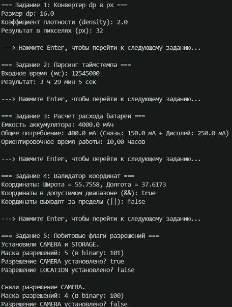

---

## Тема 2. Управляющие конструкции и операторы ветвления

Мобильные приложения постоянно реагируют на внешние события: переключение вкладок, изменение интернет-соединения, жизненный цикл Activity/Fragment.

### Пример кода (Modern Switch Expression)

```java
public class NetworkStateEvaluator {
    public enum NetworkType { NONE, GPRS, LTE, WIFI, NR_5G }

    public static String getBufferStrategy(NetworkType type) {
        return switch (type) {
            case NONE -> "Оффлайн: показать локальный кэш";
            case GPRS -> "Экономичный режим: низкое разрешение картинок";
            case LTE, WIFI -> "Стандартный режим: прогрессивная загрузка";
            case NR_5G -> "Ультра режим: предварительная загрузка 4K контента";
        };
    }
}
```

### Задания для закрепления

1. **Определение ориентации экрана:** Напишите логику, которая по переданной ширине и высоте окна выводит `"PORTRAIT"`, `"LANDSCAPE"` или `"SQUARE"`.
2. **Классификатор статуса HTTP-ответа:** Используя `switch`, верните категорию ответа сервера по его коду: Информационный (1xx), Успешный (2xx), Перенаправление (3xx), Ошибка клиента (4xx), Ошибка сервера (5xx).
3. **Симулятор таймера повторных попыток (Backoff):** С помощью цикла `for` смоделируйте 5 попыток подключения к серверу с экспоненциальной задержкой (1с, 2с, 4с, 8с, 16с).
4. **Пропуск поврежденных пакетов:** Дан цикл прохода по массиву идентификаторов сообщений чата. Если ID равен `-1` (ошибка), выполните `continue`. Если ID равен `0` (конец сессии), выполните `break`.
5. **Контроль ввода пин-кода:** Используя цикл `do-while`, реализуйте логику проверки 4-значного кода с ограничением до 3 попыток.

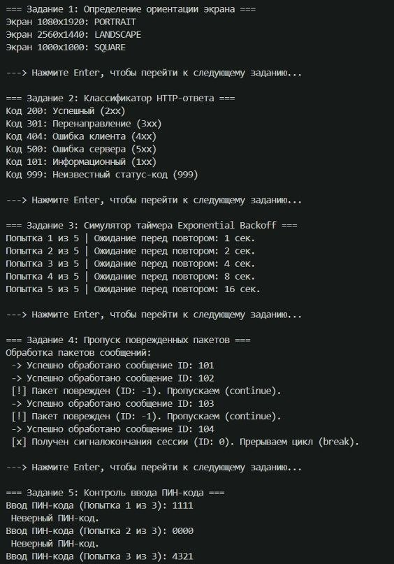

---

## Тема 3. Массивы, строки и форматирование данных

При рендеринге списков (RecyclerView) и обработке REST API ключевую роль играют массивы и неизменяемые строки `String` вместе с `StringBuilder`.

### Пример кода

```java
public class TextSanitizer {
    public static void main(String[] args) {
        String rawInput = "  +7 (999) 123-45-67  ";
        String cleanPhone = rawInput.trim().replaceAll("[^0-9+]", "");

        StringBuilder logBuilder = new StringBuilder();
        logBuilder.append("Пользователь авторизован с номером: ")
                  .append(cleanPhone)
                  .append(" [Время: ")
                  .append(System.currentTimeMillis())
                  .append("]");

        System.out.println(logBuilder.toString());
    }
}
```

### Задания для закрепления

1. **Нормализация поискового запроса:** Напишите метод, очищающий введенный пользователем поисковый запрос от лишних концевых пробелов, приводящий строку к нижнему регистру и заменяющий множественные пробелы на один.
2. **Реверс массива кадров анимации:** Дан массив строковых имен кадров анимации. Разверните его задом наперед без создания второго массива.
3. **Маскирование номера банковской карты:** Примите строку из 16 цифр и верните ее в формате `**** **** **** 1234`.
4. **Поиск пиковых значений акселерометра:** В массиве из 100 значений измерений датчика найдите максимальный всплеск (максимальную разность между соседними элементами).
5. **Генератор URL-параметров:** Дан строковый массив ключей и массив значений одинаковой длины. Соберите строку GET-запроса вида `?key1=val1&key2=val2` с использованием `StringBuilder`.

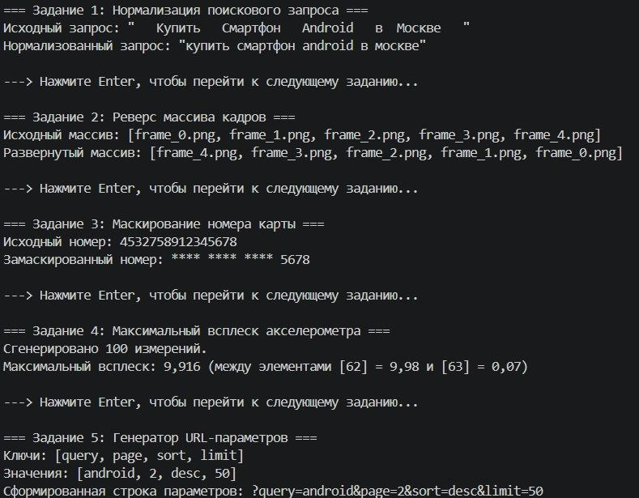

---

## Тема 4. Методы и модульность

Методы организуют бизнес-логику презентеров и ViewModel. Java поддерживает перегрузку методов (overloading) и аргументы переменной длины (varargs).

### Пример кода

```java
public class NotificationHelper {
    public static void showToast(String message) {
        showToast(message, 2000);
    }

    public static void showToast(String message, int durationMs) {
        System.out.println("[TOAST] " + message + " (Длительность: " + durationMs + "ms)");
    }

    public static void logTags(String category, String... tags) {
        System.out.print("[" + category + "] Теги: ");
        for (String tag : tags) {
            System.out.print("#" + tag + " ");
        }
        System.out.println();
    }
}
```

### Задания для закрепления

1. **Перегрузка валидатора:** Напишите метод `isValid(String email)` и его перегруженную версию `isValid(String email, boolean checkDomain)`.
2. **Форматирование валюты:** Реализуйте метод с параметрами `double amount` и `String currencySymbol`, возвращающий красиво оформленную строку для корзины магазина.
3. **Калькулятор суммарного размера кэша:** Создайте метод `calculateCache(long... fileSizesInBytes)`, возвращающий сумму всех файлов в мегабайтах (`double`).
4. **Рекурсивный поиск вложений:** Напишите рекурсивный метод для подсчета общего количества элементов во вложенной структуре папок устройства.
5. **Сравнение версий приложения:** Напишите метод `int compareVersions(String v1, String v2)`, возвращающий `1`, если `v1 > v2`, `-1`, если `v1 < v2`, и `0`, если версии равны (например, "1.12.0" и "1.9.4").

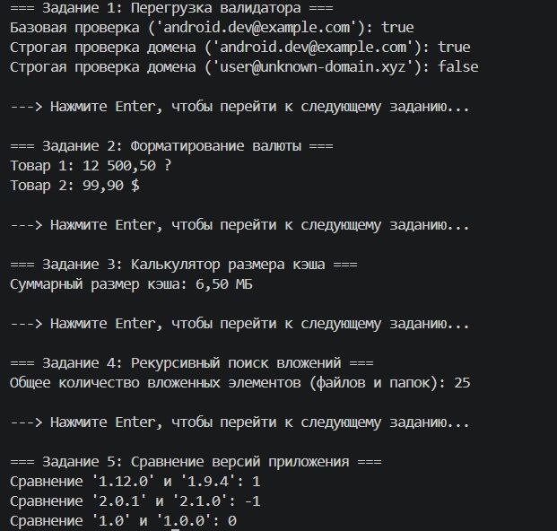

---

## Тема 5. Классы, объекты и инкапсуляция

Инкапсуляция защищает целостность внутреннего состояния мобильного экрана. Для неизменяемых моделей данных (DTO) в современном Java используются `record`.

### Пример кода

```java
// Традиционный класс с инкапсуляцией
public class UserProfile {
    private final long id;
    private String username;
    private int loyaltyPoints;

    public UserProfile(long id, String username) {
        this.id = id;
        setUsername(username);
        this.loyaltyPoints = 0;
    }

    public long getId() { return id; }

    public String getUsername() { return username; }

    public void setUsername(String username) {
        if (username == null || username.trim().isEmpty()) {
            throw new IllegalArgumentException("Имя пользователя не может быть пустым");
        }
        this.username = username.trim();
    }

    public void addPoints(int points) {
        if (points > 0) {
            this.loyaltyPoints += points;
        }
    }
}

// Современный DTO в виде record (начиная с Java 16+)
record PushNotificationDto(String title, String body, long timestamp, boolean isRead) {}
```

### Задания для закрепления

1. **Модель экрана настроек (SettingsModel):** Спроектируйте класс с приватными полями `isDarkMode`, `volumeLevel` (от 0 до 100) и `appLanguage`. Обеспечьте валидацию уровня громкости в сеттере.
2. **DTO корзины интернет-магазина:** Создайте `record CartItem(String id, String title, double price, int count)`. Добавьте в него метод вычисления общей стоимости позиции.
3. **Счетчик непрочитанных пушей:** Разработайте класс `BadgeCounter`, в котором значение счетчика нельзя установить в отрицательное число, а инкремент и декремент происходят через отдельные методы.
4. **Инкапсулированный таймер сессии:** Создайте класс `SessionTracker` с приватными полями времени входа и последнего действия. Напишите метод проверки, истекла ли сессия (timeout = 15 минут).
5. **Модель геопозиции:** Создайте класс `GeoPoint` с неизменяемыми полями широты и долготы, валидируемыми в конструкторе.

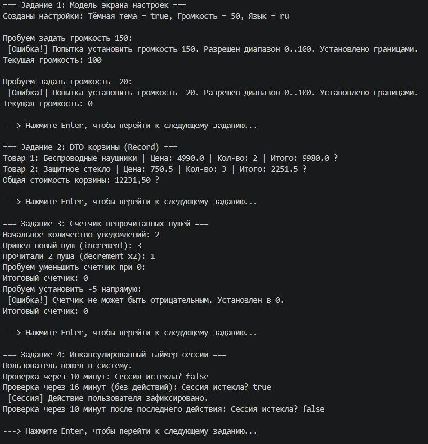
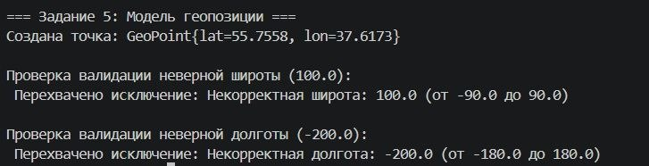

---

## Тема 6. Наследование и полиморфизм

Наследование позволяет переиспользовать базовое поведение виджетов, а полиморфизм — единообразно отрисовывать разнородные элементы списков (списки карточек, баннеров и кнопок).

### Пример кода

```java
// Базовый элемент UI
public abstract class UiComponent {
    protected int id;
    protected boolean isVisible;

    public UiComponent(int id) {
        this.id = id;
        this.isVisible = true;
    }

    public abstract void render();
}

// Дочерний компонент кнопки
public class ButtonComponent extends UiComponent {
    private final String text;

    public ButtonComponent(int id, String text) {
        super(id);
        this.text = text;
    }

    @Override
    public void render() {
        System.out.println("Рендер кнопки [" + id + "]: '" + text + "'");
    }
}

// Дочерний компонент изображения
public class ImageComponent extends UiComponent {
    private final String imageUrl;

    public ImageComponent(int id, String imageUrl) {
        super(id);
        this.imageUrl = imageUrl;
    }

    @Override
    public void render() {
        System.out.println("Рендер изображения [" + id + "] по адресу: " + imageUrl);
    }
}
```

### Задания для закрепления

1. **Иерархия экранов приложения:** Создайте базовый класс `BaseScreen` (с методами `onOpen()`, `onClose()`) и наследников: `LoginScreen`, `HomeScreen`, `SettingsScreen`.
2. **Полиморфный обработчик аналитики:** Реализуйте базовый класс `AnalyticsEvent` и подклассы `ClickEvent`, `PurchaseEvent`, `ScreenViewEvent`. Напишите сервис, принимающий `AnalyticsEvent` и выводящий разную логику логирования.
3. **Модели сенсоров смартфона:** Создайте класс `DeviceSensor` и наследников `GyroscopeSensor` и `LightSensor`. Реализуйте полиморфный метод `readData()`.
4. **Виджеты с кастомной отрисовкой:** Напишите метод `drawScreen(List<UiComponent> components)`, который итерируется по коллекции и вызывает метод `render()` для каждого элемента независимо от его типа.
5. **Тарифные планы подписки:** Создайте базовый класс `Subscription` с расчетом стоимости и подклассы: `MonthlySubscription`, `FamilySubscription` (с учетом количества пользователей), `AnnualDiscountSubscription`.

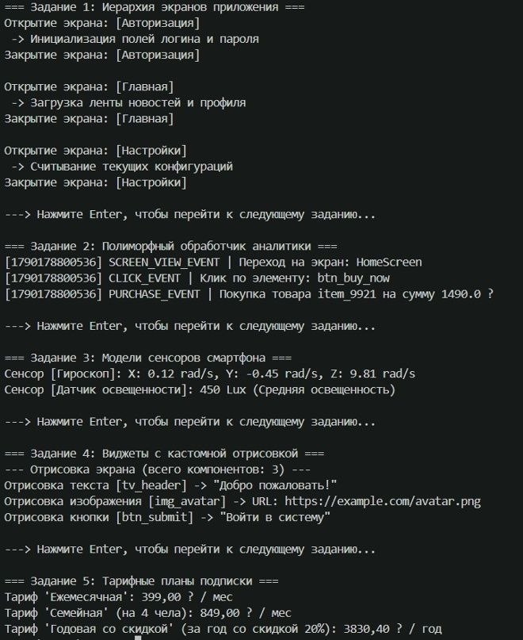

---

## Тема 7. Абстрактные классы и интерфейсы

Интерфейсы определяют контракты взаимодействия. В Android через интерфейсы традиционно реализуются обработчики кликов (`OnClickListener`), колбэки сетевых вызовов и сервис-локаторы.

### Пример кода

```java
public interface OnItemClickListener<T> {
    void onItemClick(T item, int position);

    // Default-метод (Java 8+)
    default void onItemLongClick(T item, int position) {
        System.out.println("Долгое нажатие на элемент: " + position);
    }
}

public interface NetworkSyncable {
    void syncWithCloud();
}

public class NoteItem implements NetworkSyncable {
    private final String content;

    public NoteItem(String content) {
        this.content = content;
    }

    @Override
    public void syncWithCloud() {
        System.out.println("Синхронизация заметки: " + content);
    }
}
```

### Задания для закрепления

1. **Контракт хранилища данных:** Создайте интерфейс `KeyValueStorage` с методами `save(String key, String value)`, `get(String key)`, `clear()`. Реализуйте класс `MemoryStorage`.
2. **Колбэк загрузки изображения:** Напишите интерфейс `ImageLoadCallback` с методами `onSuccess(String bitmapRef)` и `onError(Throwable error)`.
3. **Слушатель жизненного цикла фоновой задачи:** Спроектируйте интерфейс `BackgroundTaskListener` со стандартным методом `onProgress(int percentage)`.
4. **Множественная реализация:** Создайте класс `MediaFile`, реализующий два интерфейса: `Playable` (метод `play()`, `stop()`) и `Shareable` (метод `shareViaBluetooth()`).
5. **Функциональный интерфейс для фильтрации:** Напишите аннотированный `@FunctionalInterface` `PredicateValidator<T>` с методом `boolean validate(T data)` и протестируйте его через лямбда-выражение.

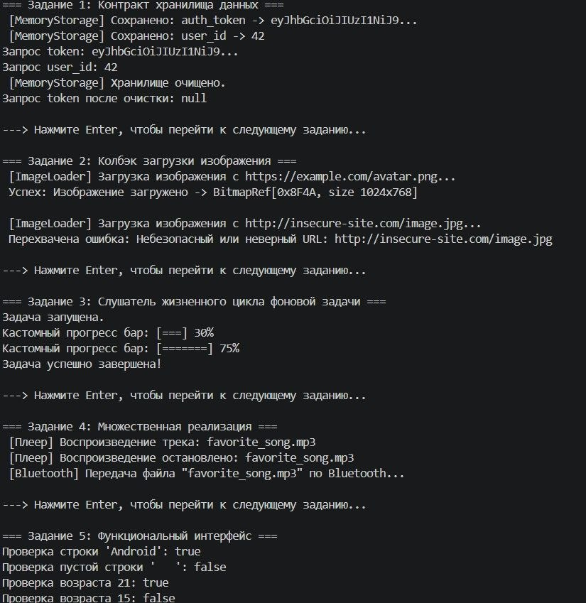

---

## Тема 8. Коллекции и Generics

Коллекции (`List`, `Set`, `Map`) составляют основу передачи списков в адаптеры UI и сопоставления связей типа "Ключ-Значение".

### Пример кода

```java
import java.util.*;

public class ChatRepository {
    private final Map<String, List<String>> userDialogs = new HashMap<>();

    public void addMessage(String userId, String message) {
        userDialogs.computeIfAbsent(userId, k -> new ArrayList<>()).add(message);
    }

    public List<String> getDialog(String userId) {
        return userDialogs.getOrDefault(userId, Collections.emptyList());
    }

    public static void main(String[] args) {
        ChatRepository repo = new ChatRepository();
        repo.addMessage("user_42", "Привет, заказ доставлен?");
        repo.addMessage("user_42", "Да, спасибо!");

        System.out.println("Сообщения пользователя 42: " + repo.getDialog("user_42"));
    }
}
```

### Задания для закрепления

1. **Удаление дубликатов контактов:** Дан список телефонных номеров с дубликатами. Используя `Set`, верните очищенную от повторов коллекцию с сохранением исходного порядка добавления (`LinkedHashSet`).
2. **Очередь сетевых запросов:** Реализуйте имитацию очереди синхронизации данных `Queue<String>` (FIFO), обрабатывая элементы по мере поступления.
3. **Обобщенный ответ API (Generic ApiResponse):** Создайте класс `ApiResponse<T>` с полями `int statusCode`, `T data`, `String errorMessage` и булевым геттером `isSuccessful()`.
4. **Сортировка товаров по цене и популярности:** Дан `List<Product>`. Отсортируйте коллекцию с помощью `Comparator` сначала по возрастанию цены, а при равной цене — по рейтингу.
5. **Кэш экранов (LRU Cache концепт):** Спроектируйте простейший механизм кэширования последних открытых фрагментов с ограничением максимальной емкости в 5 элементов.

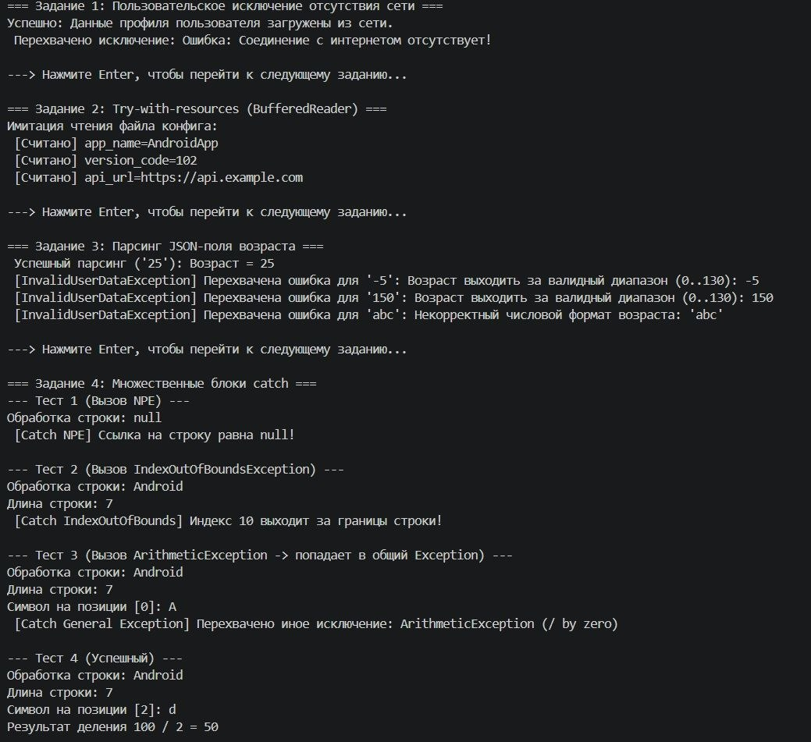
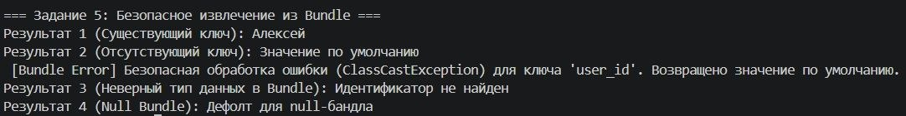

---

## Тема 9. Исключения и безопасность выполнения

Падение мобильного приложения (Crash) недопустимо. Грамотная обработка исключений гарантирует стабильность приложения при потере сети или повреждении входных данных.

### Пример кода

```java
public class ConfigParser {
    public static int parsePort(String portString) {
        try {
            return Integer.parseInt(portString);
        } catch (NumberFormatException e) {
            System.err.println("Ошибка преобразования порта. Установлен порт по умолчанию 8080: " + e.getMessage());
            return 8080;
        } finally {
            System.out.println("Проверка порта завершена.");
        }
    }
}
```

### Задания для закрепления

1. **Пользовательское исключение отсутствия сети:** Создайте проверяемое исключение `NoInternetException` и напишите метод имитации запроса, выбрасывающий его при флаге `hasConnection == false`.
2. **Конструкция try-with-resources:** Напишите метод чтения файла локального конфига с автоматическим закрытием потока ввода (`BufferedReader`).
3. **Парсинг JSON-поля возраста:** Реализуйте метод `int parseAge(String ageStr)`, выбрасывающий непроверяемое исключение `InvalidUserDataException`, если возраст отрицательный или превышает 130.
4. **Множественные блоки catch:** Напишите блок обработки `try-catch`, раздельно обрабатывающий `NullPointerException`, `IndexOutOfBoundsException` и общий `Exception`.
5. **Безопасное извлечение значения из Bundle:** Напишите утилитный метод, безопасно читающий строковое значение по ключу, возвращающий значение по умолчанию при возникновении любой ошибки.

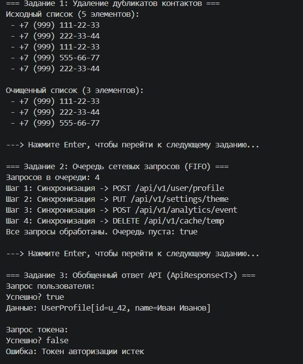
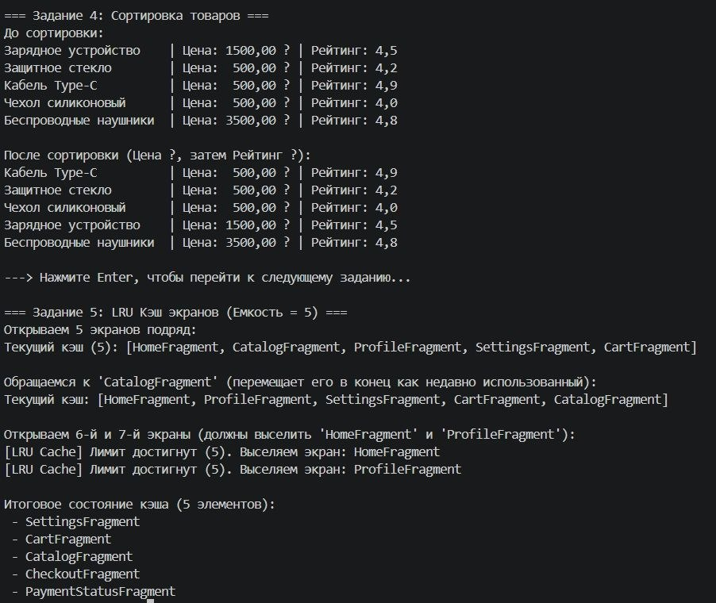

---

## Практические задания:

Каждое задание представляет собой фрагмент реальной логики мобильного приложения (Android UI-стейт, работа с хранилищем, сетью, сенсорами и валидацией).

### Блок 1: Авторизация, безопасность и валидация ввода

1. **Валидатор надежности пароля:** Проверьте пароль на соответствие критериям: минимум 8 символов, хотя бы одна заглавная буква, одна цифра и один специальный знак (`!@#$%^&*`).
2. **Нормализатор телефонных номеров:** Принимайте строку в произвольном формате (например, `8 (999) 000-11-22` или `+7 999 000 11 22`) и приводите её к строгому стандарту E.164 (`+79990001122`).
3. **Генератор одноразового SMS-кода:** Напишите метод генерации 6-значного числового OTP-кода.
4. **Проверка срока действия JWT-токена:** Дан Unix-таймстемп истечения токена в секундах. Определите, активен ли токен относительно текущего системного времени.
5. **Маскировка персональных данных (PII):** Замаскируйте адрес электронной почты: `alexander.ivanov@mail.ru` -> `a***********v@mail.ru`.
6. **Блокировщик брутфорса:** Реализуйте класс `LoginThrottler`, который после 5 неудачных попыток ввода пароля блокирует ввод на 60 секунд.
7. **Шифратор перестановкой для локальных заметок:** Напишите простейший обратимый шифратор строк для сокрытия черновиков в локальной базе.
8. **Проверка биометрической готовности:** Напишите логику оценки возможности аутентификации по отпечатку пальца на основе набора булевых флагов оборудования и разрешений.
9. **Контроль сессии по тайм-ауту:** Реализуйте сброс состояния экрана в случае неактивности пользователя более 3 минут.
10. **Валидатор промокода:** Проверьте правильность промокода по маске: 4 заглавные латинские буквы, дефис, 4 цифры (например, `SALE-2026`).

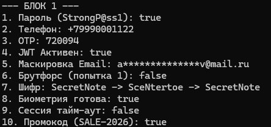

### Блок 2: Работа со списками, каталогами и кэшем (RecyclerView Logic)

11. **DiffUtil-компаратор элементов списка:** Напишите метод, принимающий старый и новый списки элементов `NewsItem` и возвращающий список ID измененных и удаленных позиций.
12. **Пагинация ленты новостей:** Напишите класс `PaginationHelper`, который по номеру страницы `page` и размеру страницы `pageSize = 20` извлекает нужный срез из общего массива новостей.
13. **Группировка контактов по первой букве:** Дан список имен. Сгруппируйте их в `Map<Character, List<String>>` для отображения заголовков секций.
14. **Полнотекстовый фильтр списка:** Реализуйте метод фильтрации каталога товаров по вхождению подстроки в наименование или артикул без учета регистра.
15. **Карусель промо-баннеров:** Реализуйте циклическое получение следующего элемента баннера по индексу текущего клика.
16. **Подсчет суммарной стоимости корзины с учетом промокода:** Рассчитайте сумму позиций с учетом скидок на отдельные категории товаров.
17. **Удаление свайпом с возможностью отмены (Undo):** Спроектируйте логику временного буфера удаленного элемента списка с таймером фиксации удаления.
18. **Сортировка чатов по времени последнего сообщения:** Отсортируйте список диалогов так, чтобы сверху оказались диалоги с самыми свежими сообщениями.
19. **Поиск дубликатов в галерее по контрольной сумме:** Напишите алгоритм поиска повторяющихся файлов по размеру и имени.
20. **Ограничитель емкости кэша картинок:** Реализуйте стратегию вытеснения самого старого файла (FIFO), если суммарный объем картинок превысил 100 МБ.

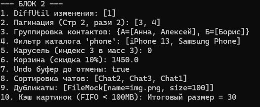

### Блок 3: Сеть, парсинг данных и офлайн-синхронизация

21. **Парсер параметров диплинка (Deep Link):** Извлеките параметры маршрутизации из URL вида `app://shop/product?id=452&source=push`.
22. **Симулятор Retry-политики запроса:** Смоделируйте выполнение сетевого вызова с 3 повторами при возникновении `SocketTimeoutException`.
23. **Очередь отложенных офлайн-действий:** Создайте класс `OfflineActionQueue`, сохраняющий лайки и комментарии при отсутствии сети и отправляющий их пачкой при подключении.
24. **Слияние локальных данных с сервером (Conflict Resolver):** Напишите резолвер конфликта версии заметки: если серверная версия новее локальной, обновлять локальную, иначе отправлять запрос на перезапись.
25. **Оценка скорости скачивания файла:** По количеству байт и времени в миллисекундах рассчитайте скорость передачи в КБ/с и Мбит/с.
26. **Парсинг заголовков пагинации сервера:** Извлеките из заголовка `Link: <https://api.com/items?page=3>; rel="next"` номер следующей страницы.
27. **Проверка актуальности кэша по ETag:** Реализуйте логику: если переданный `ETag` совпадает с сохраненным, возвращать ответ `304 Not Modified` без загрузки тела.
28. **Форматирование байтов в читаемый вид:** Переведите число байт в строку: `1024` -> `"1.0 KB"`, `1048576` -> `"1.0 MB"`, `1536` -> `"1.5 KB"`.
29. **Имитация веб-сокета для биржевого виджета:** Напишите интерфейс слушателя котировок валют и генератор событий с интервалом.
30. **Валидатор ответа API:** Напишите метод проверки обязательных полей JSON-объекта профиля на `null`.

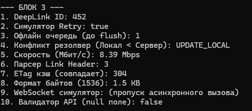

### Блок 4: Управление состоянием экрана и UI-архитектура

31. **Конечный автомат экрана загрузки (UI State MVI):** Реализуйте переключение состояний экрана через `sealed`-иерархию или `enum`: `Loading`, `Success(data)`, `Empty`, `Error(message)`.
32. **Дебаунсер кликов (Anti-Double Click):** Напишите класс-обертку над кликом, предотвращающий повторный вызов действия, если с момента прошлого клика прошло менее 500 мс.
33. **Стек навигации экранов (BackStack):** Реализуйте собственную структуру данных стека экранов с поддержкой операций `push(Screen)`, `pop()` и `popToRoot()`.
34. **Моделирование темной и светлой темы:** Спроектируйте класс `ThemePalette`, возвращающий шестнадцатеричные коды цветов (HEX) в зависимости от выбранного режима оформления.
35. **Расчет прогресса заполнения профиля:** Определите процент заполненности аккаунта пользователя (аватар, био, телефон, почта, город).
36. **Инвертор цвета текста для контрастности:** По заданному цвету фона (RGB) вычислите, какой цвет текста отображать для читаемости — белый или черный (по формуле яркости YIQ).
37. **Форматирование счетчика лайков:** Переведите большие числа в сокращения: `950` -> `"950"`, `1200` -> `"1.2K"`, `1500000` -> `"1.5M"`.
38. **Менеджер системных диалогов:** Реализуйте класс очереди показа диалоговых окон, исключающий перекрытие одного всплывающего окна другим.
39. **Валидатор состояния кнопки "Оплатить":** Кнопка активна только при условии: корзина не пуста, выбран способ оплаты, адрес доставки подтвержден.
40. **Транслятор ошибок для пользователя:** Напишите метод, переводящий системные исключения (`TimeoutException`, `UnknownHostException`) в понятные человекочитаемые подсказки на русском языке.

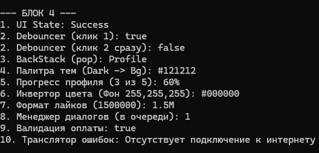

### Блок 5: Аппаратные функции, геолокация и фоновые задачи

41. **Расчет расстояния между двумя GPS-точками:** Реализуйте формулу гаверсинусов (Haversine formula) для определения дистанции в метрах между координатами пользователя и курьера.
42. **Определитель вхождения в геозону (Geofencing):** Напишите метод, определяющий, находится ли точка с координатами `(lat, lon)` внутри окружности радиуса `R` с центром в `(centerLat, centerLon)`.
43. **Энергосберегающий планировщик геолокации:** Изменяйте частоту опроса датчика GPS в зависимости от уровня заряда батареи: > 50% (каждые 5 сек), 15-50% (каждые 30 сек), < 15% (раз в 5 минут).
44. **Детектор падения смартфона (акселерометр):** Напишите алгоритм, определяющий состояние невесомости / резкого ускорения по 3 осям `(X, Y, Z)` при превышении критического порога.
45. **Шагомер на основе пиковых амплитуд:** Дан массив показаний вертикального ускорения. Подсчитайте количество совершенных шагов по локальным максимумам выше заданного барьера.
46. **Контроллер яркости по датчику освещенности:** Преобразуйте люксы (Lux) внешнего освещения в процент яркости экрана (0-100%) по логарифмической шкале.
47. **Планировщик фоновой синхронизации данных:** Проверьте совокупность системных условий для старта тяжелой синхронизации: подключение к Wi-Fi + устройство подключено к зарядному устройству.
48. **Монитор расхода мобильного трафика:** Спроектируйте класс, суммирующий трафик раздельно для мобильной сети и Wi-Fi с предупреждением при достижении лимита в 5 ГБ.
49. **Плеер аудиофайлов (State Machine):** Смоделируйте жизненный цикл аудиоплеера: `IDLE` -> `INITIALIZED` -> `PREPARED` -> `PLAYING` -> `PAUSED` -> `STOPPED`. Блокируйте недопустимые переходы.
50. **Логгер крашей приложения:** Реализуйте запись стектрейса ошибки, версии Android, модели смартфона и свободного места на накопителе в форматированный отчет об аварийном завершении.

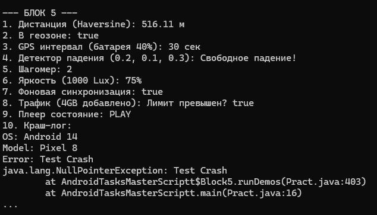

---
